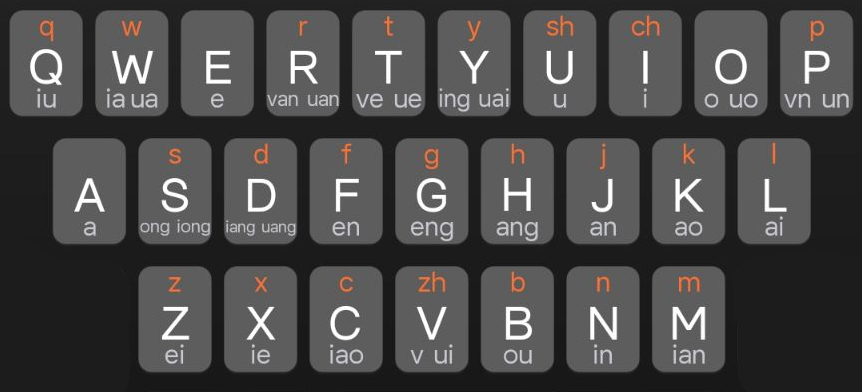

# <font color=#39c5bb> :sparkles: 跳转 </font>

> [rime完整码表](./DICT/rime)    
> [sougou自定义码表,方案](./DICT/sougou)    

> [码表制作日志参考](./op-log.md)    

> [工具使用说明文档](./bin/readme.md)    

# <font color=#39c5bb> :sparkles: 目录结构 </font>

```
├── bin                          # 指令工具,部分需要编译src下的makefile生成
├── DICT                         # 码表目录
│   ├── overview                 # 标准格式的ranwu总揽
│   ├── rime                     # rime词库
│   └── sougou                   # sougou五笔或其他软件中挂载
├── LICENSE
├── op-log.md                    # 词库的操作日志
├── readme.md
├── share
│   ├── component(will-deprecated# ranwu的原始词库记录(后期必然会弃用)
│   ├── freq                     # 450w频表
│   ├── pinyin                   # 90w拼音表
│   ├── res-pictures
│   └── single                   # 各种单字表
└── src
    ├── binsrc                   # bin工具的源码
    ├── c-core(deprecated)       # 旧的c解析码表用(弃用)
    ├── CMakeLists.txt           # makefile会调用这个Cmakelists.txt
    ├── cppcore                  # cpp写的表对象核心
    └── makefile                 # cd到目录下运行make以运行这个makefile

android fcitx5 install:
	adb push DICT/rime /sdcard/Android/data/org.fcitx.fcitx5.android/files/data/
linux/windows/etc install:
	cp -r DICT/rime <rime-dir>
```

# <font color=#39c5bb> :sparkles: 输入法偏好配置 </font>

- [x] <font color=#ffa500>切换: alt + shift</font>
- [x] <font color=#ffa500>临时切换: shift</font>
- [x] <font color=#ffa500>反查: `` ` ``</font>
- [x] <font color=#ffa500>第四码不自动上屏，第五码顶上屏</font>
- [x] <font color=#ffa500>`空格` `;` `‘`代表1,2,3候选</font>
- [x] <font color=#ffa500>`[` `]`前后翻页</font>

# <font color=#39c5bb> :sparkles: 编码规则 </font>

* <font color=#39c5bb> :rocket: 自然码和86五笔字根 </font>
<div style="display:flex;">


</div>

> <font color=#39c5bb> 自然码规则可以看成被替换的拼音，零声母除外 </font>    
> <font color=#39c5bb> 五笔编码规则: https://github.com/condexpr01/rime-wubi86ex-powerful </font>    

* <font color=#39c5bb> :rocket: 燃舞(然五音形)规则 </font>    
> 单字: `自然码+86五笔前2码`    
> 双字: `第1字第1码+第2字第1码` 或 `第1字前2码+第2字前2码`    
> 三字: `第1字第1码+第2字第1码+第3字前2码`    
> 四字: `第1字第1码+第2字第1码+第3字第1码+第4字第1码`    


# <font color=#39c5bb>:sparkles: 词库</font>

## <font color=#39c5bb> :sparkles: 词库排序大体规则 </font>

> <font color=#ffa500>1号排`字`, 2号排`词/键名字`, 3号及以上排更多可能的选择</font><br>
> <font color=#ffa500>当1号实在没有字时, 1号排`词`, 2号及以上排更多可能的选择</font><br>

---
## <font color=#39c5bb> :sparkles: 测试性能记录 </font>

<font color=#ffa500>

| 词库行数 | 测试码长 |
|:-:|:-:|
| 179104 DICT/overview/ranwu | unknown |

</font>

---
## <font color=#39c5bb> :sparkles: 1码 </font>
* <font color=#39c5bb> :rocket: 1简1号</font>

<font color=#ffa500>

|工|发|的|所|爱|
|:-:|:-:|:-:|:-:|:-:|
|和|经|看|了|民|
|他|人|而|我|去|
|有|是|产|哦|平|
|那|不|这|从|下|

</font>

* <font color=#39c5bb> :rocket: 1简2号</font>

<font color=#ffa500>

|个|放|都|色|按|
|:-:|:-:|:-:|:-:|:-:|
|好|就|口|里|明|
|她|如|儿|为|起|
|又|上|成|噢|片|
|女|被|着|此|小|

</font>

## <font color=#39c5bb> :sparkles: 2码 </font>
> <font color=#ffa500>2简1号,常为字或高频2字词</font>
> <font color=#ffa500>2简2号,常为2字词,高频词和容易记住的叠叠字</font>

<font color=#ffa500>

|ag,1=挨个|af,1=安抚|ad,1=爱戴|as,1=暗算|aa,1=啊|
|:-|:-|:-|:-|:-|
|ag,2=爱过|af,2=案发|ad,2=爱的|as,2=氨酸|aa,2=嗷嗷|
||||||
|ah,1=昂|aj,1=按键|ak,1=爱哭|al,1=案例|am,1=暧昧|
|ah,2=爱好|aj,2=安静|ak,2=爱看|al,2=暗恋|am,2=按摩|
||||||
|at,1=凹凸|ar,1=矮人|ae,1=啊嗯|aw,1=安稳|aq,1=爱情|
|at,2=艾特|ar,2=黯然|ae,2=挨饿|aw,2=安慰|aq,2=安全|
||||||
|ay,1=奥运|au,1=按时|ai,1=爱|ao,1=傲|ap,1=阿婆|
|ay,2=阿姨|au,2=暗示|ai,2=暗处||ap,2=安排|
||||||
|an,1=安|ab,1=癌变|av,1=安装|ac,1=按此|ax,1=安心|
|an,2=按钮|ab,2=岸边|av,2=按照|ac,2=暗藏|ax,2=爱心|

</font>


---

<font color=#ffa500>

|bg,1=崩|bf,1=本|bd,1=部队|bs,1=不算|ba,1=把|
|:-|:-|:-|:-|:-|
|bg,2=报告|bf,2=部分|bd,2=病毒|bs,2=比赛|ba,2=悲哀|
||||||
|bh,1=帮|bj,1=半|bk,1=包|bl,1=白|bm,1=边|
|bh,2=保护|bj,2=比较|bk,2=崩溃|bl,2=比例|bm,2=避免|
||||||
|bt,1=标题|br,1=比如|be,1=布尔|bw,1=部位|bq,1=版权|
|bt,2=不同|br,2=别人|be,2=报恩|bw,2=把握|bq,2=并且|
||||||
|by,1=并|bu,1=不|bi,1=比|bo,1=波|bp,1=背叛|
|by,2=毕业|bu,2=鄙视|bi,2=编程|bo,2=白鸥|bp,2=爆破|
||||||
|bn,1=宾|bb,1=宝宝|bv,1=帮助|bc,1=表|bx,1=别|
|bn,2=不能|bb,2=帮帮|bv,2=标准|bc,2=保存|bx,2=必须|

</font>


---

<font color=#ffa500>

|cg,1=曾|cf,1=岑|cd,1=草地|cs,1=从|ca,1=擦|
|:-|:-|:-|:-|:-|
|cg,2=错过|cf,2=采访|cd,2=菜单|cs,2=厕所|ca,2=惨案|
||||||
|ch,1=藏|cj,1=参|ck,1=草|cl,1=才|cm,1=层面|
|ch,2=策划|cj,2=曾经|ck,2=参考|cl,2=材料|cm,2=聪明|
||||||
|ct,1=从头|cr,1=窜|ce,1=测|cw,1=此外|cq,1=采取|
|ct,2=餐厅|cr,2=脆弱|ce,2=从而|cw,2=错误|cq,2=从前|
||||||
|cy,1=参与|cu,1=粗|ci,1=此|co,1=错|cp,1=存|
|cy,2=采用|cu,2=测试|ci,2=财产|co,2=措|cp,2=裁判|
||||||
|cn,1=采纳|cb,1=凑|cv,1=脆|cc,1=层次|cx,1=猜想|
|cn,2=才能|cb,2=从不|cv,2=辞职|cc,2=从此|cx,2=促销|

</font>


---

<font color=#ffa500>

|dg,1=等|df,1=扽|dd,1=到底|ds,1=动|da,1=大|
|:-|:-|:-|:-|:-|
|dg,2=大概|df,2=巅峰|dd,2=达到|ds,2=打算|da,2=答案|
||||||
|dh,1=当|dj,1=单|dk,1=到|dl,1=代|dm,1=点|
|dh,2=的话|dj,2=大家|dk,2=贷款|dl,2=大量|dm,2=对面|
||||||
|dt,1=当天|dr,1=断|de,1=的|dw,1=嗲|dq,1=丢|
|dt,2=灯塔|dr,2=当然|de,2=地|dw,2=单位|dq,2=定期|
||||||
|dy,1=定|du,1=度|di,1=底|do,1=多|dp,1=顿|
|dy,2=大约|du,2=但是|di,2=当初|do,2=斗殴|dp,2=搭配|
||||||
|dn,1=大脑|db,1=都|dv,1=对|dc,1=掉|dx,1=爹|
|dn,2=电脑|db,2=代表|dv,2=当中|dc,2=单词|dx,2=东西|

</font>


---

<font color=#ffa500>

|eg,1=儿歌|ef,1=而非|ed,1=额度|es,1=而死|ea,1=嗯啊|
|:-|:-|:-|:-|:-|
|eg,2=耳光|ef,2=二分|ed,2=耳朵|es,2=耳塞|ea,2=恩爱|
||||||
|eh,1=恶化|ej,1=而今|ek,1=耳孔|el,1=恶劣|em,1=噩梦|
|eh,2=欸嘿|ej,2=耳机|ek,2=耳廓|el,2=而来|em,2=恶魔|
||||||
|et,1=额头|er,1=二|ee,1=饿|ew,1=耳闻|eq,1=而去|
|et,2=儿童|er,2=恶人|ee,2=嗯嗯|ew,2=额外|eq,2=而且|
||||||
|ey,1=恶意|eu,1=二手|ei,1=欸||ep,1=耳旁|
|ey,2=而已|eu,2=而是|ei,2=恶臭||ep,2=耳畔|
||||||
|en,1=恩|eb,1=耳边|ev,1=二者|ec,1=耳侧|ex,1=恶性|
|en,2=嗯呐|eb,2=恶霸|ev,2=遏制|ec,2=恩赐|ex,2=恶心|

</font>


---

<font color=#ffa500>

|fg,1=风|ff,1=分|fd,1=发达|fs,1=放松|fa,1=发|
|:-|:-|:-|:-|:-|
|fg,2=覆盖|ff,2=方法|fd,2=反对|fs,2=粉丝|fa,2=方案|
||||||
|fh,1=放|fj,1=反|fk,1=罚款|fl,1=分离|fm,1=父母|
|fh,2=符合|fj,2=附近|fk,2=疯狂|fl,2=法律|fm,2=方面|
||||||
|ft,1=法庭|fr,1=否认|fe,1=份额|fw,1=氛围|fq,1=父亲|
|ft,2=反弹|fr,2=繁荣|fe,2=反而|fw,2=服务|fq,2=放弃|
||||||
|fy,1=赋予|fu,1=服|fi,1=发出|fo,1=佛|fp,1=发票|
|fy,2=费用|fu,2=发生|fi,2=非常||fp,2=分配|
||||||
|fn,1=烦恼|fb,1=否|fv,1=防止|fc,1=讽刺|fx,1=分析|
|fn,2=愤怒|fb,2=发布|fv,2=分钟|fc,2=服从|fx,2=发现|

</font>


---

<font color=#ffa500>

|gg,1=更|gf,1=跟|gd,1=光|gs,1=工|ga,1=尬|
|:-|:-|:-|:-|:-|
|gg,2=刚刚|gf,2=规范|gd,2=规定|gs,2=共|ga,2=公安|
||||||
|gh,1=刚|gj,1=感|gk,1=高|gl,1=该|gm,1=干嘛|
|gh,2=规划|gj,2=国家|gk,2=公开|gl,2=鼓励|gm,2=购买|
||||||
|gt,1=沟通|gr,1=管|ge,1=个|gw,1=挂|gq,1=歌曲|
|gt,2=共同|gr,2=个人|ge,2=感恩|gw,2=国外|gq,2=感情|
||||||
|gy,1=怪|gu,1=古|gi,1=构成|go,1=过|gp,1=滚|
|gy,2=关于|gu,2=格式|gi,2=观察|go,2=干呕|gp,2=股票|
||||||
|gn,1=功能|gb,1=够|gv,1=鬼|gc,1=干脆|gx,1=关系|
|gn,2=国内|gb,2=改变|gv,2=关注|gc,2=刚才|gx,2=更新|

</font>


---

<font color=#ffa500>

|hg,1=哼|hf,1=很|hd,1=黄|hs,1=红|ha,1=哈|
|:-|:-|:-|:-|:-|
|hg,2=火锅|hf,2=回复|hd,2=很多|hs,2=坏死|ha,2=黑暗|
||||||
|hh,1=行|hj,1=汉|hk,1=好|hl,1=还|hm,1=后面|
|hh,2=狠狠|hj,2=回家|hk,2=很快|hl,2=婚礼|hm,2=号码|
||||||
|ht,1=回头|hr,1=换|he,1=和|hw,1=化|hq,1=获取|
|ht,2=合同|hr,2=忽然|he,2=花儿|hw,2=毫无|hq,2=回去|
||||||
|hy,1=坏|hu,1=乎|hi,1=合成|ho,1=或|hp,1=混|
|hy,2=欢迎|hu,2=还是|hi,2=好处|ho,2=海鸥|hp,2=和平|
||||||
|hn,1=还能|hb,1=后|hv,1=会|hc,1=喝彩|hx,1=或许|
|hn,2=怀念|hb,2=好吧|hv,2=或者|hc,2=花草|hx,2=好像|

</font>


---

<font color=#ffa500>

|ig,1=成|if,1=沉|id,1=床|is,1=冲|ia,1=差|
|:-|:-|:-|:-|:-|
|ig,2=成功|if,2=出发|id,2=程度|is,2=出色|ia,2=尘埃|
||||||
|ih,1=常|ij,1=产|ik,1=超|il,1=拆|im,1=充满|
|ih,2=称号|ij,2=超级|ik,2=出口|il,2=出来|im,2=沉默|
||||||
|it,1=传统|ir,1=传|ie,1=车|iw,1=欻|iq,1=出去|
|it,2=畅通|ir,2=承认|ie,2=丑恶|iw,2=成为|iq,2=长期|
||||||
|iy,1=揣|iu,1=出|ii,1=吃|io,1=戳|ip,1=春|
|iy,2=差异|iu,2=承受|ii,2=常常|io,2=啜|ip,2=产品|
||||||
|in,1=处女|ib,1=抽|iv,1=吹|ic,1=尺寸|ix,1=持续|
|in,2=承诺|ib,2=成本|iv,2=成长|ic,2=纯粹|ix,2=创新|

</font>


---

<font color=#ffa500>

|jg,1=结果|jf,1=解放|jd,1=将|js,1=炯|ja,1=煎熬|
|:-|:-|:-|:-|:-|
|jg,2=价格|jf,2=警方|jd,2=觉得|js,2=角色|ja,2=骄傲|
||||||
|jh,1=机会|jj,1=解决|jk,1=健康|jl,1=建立|jm,1=建|
|jh,2=计划|jj,2=经济|jk,2=艰苦|jl,2=交流|jm,2=节目|
||||||
|jt,1=觉|jr,1=卷|je,1=巨额|jw,1=加|jq,1=就|
|jt,2=今天|jr,2=肌肉|je,2=金额|jw,2=今晚|jq,2=酒|
||||||
|jy,1=经|ju,1=巨|ji,1=即|jo,1=解耦|jp,1=均|
|jy,2=教育|ju,2=就是|ji,2=基础|jo,2=奇偶|jp,2=奖品|
||||||
|jn,1=进|jb,1=具备|jv,1=禁止|jc,1=交|jx,1=接|
|jn,2=技能|jb,2=基本|jv,2=紧张|jc,2=精彩|jx,2=继续|

</font>


---

<font color=#ffa500>

|kg,1=坑|kf,1=肯|kd,1=况|ks,1=空|ka,1=卡|
|:-|:-|:-|:-|:-|
|kg,2=客观|kf,2=开发|kd,2=看到|ks,2=快速|ka,2=可爱|
||||||
|kh,1=抗|kj,1=看|kk,1=靠|kl,1=开|km,1=科目|
|kh,2=客户|kj,2=科技|kk,2=看看|kl,2=快乐|km,2=开幕|
||||||
|kt,1=空调|kr,1=宽|ke,1=可|kw,1=夸|kq,1=空气|
|kt,2=卡通|kr,2=客人|ke,2=开恩|kw,2=看完|kq,2=口腔|
||||||
|ky,1=快|ku,1=苦|ki,1=看出|ko,1=括|kp,1=困|
|ky,2=可以|ku,2=开始|ki,2=课程|ko,2=扩|kp,2=恐怕|
||||||
|kn,1=困难|kb,1=口|kv,1=亏|kc,1=开采|kx,1=开心|
|kn,2=可能|kb,2=恐怖|kv,2=看着|kc,2=库存|kx,2=科学|

</font>


---

<font color=#ffa500>

|lg,1=冷|lf,1=立法|ld,1=两|ls,1=龙|la,1=拉|
|:-|:-|:-|:-|:-|
|lg,2=老公|lf,2=浪费|ld,2=领导|ls,2=类似|la,2=恋爱|
||||||
|lh,1=狼|lj,1=蓝|lk,1=老|ll,1=来|lm,1=连|
|lh,2=良好|lj,2=了解|lk,2=离开|ll,2=力量|lm,2=里面|
||||||
|lt,1=略|lr,1=乱|le,1=乐|lw,1=俩|lq,1=留|
|lt,2=轮胎|lr,2=利润|le,2=累饿|lw,2=另外|lq,2=乐趣|
||||||
|ly,1=令|lu,1=路|li,1=里|lo,1=罗|lp,1=论|
|ly,2=利用|lu,2=来说|li,2=凌晨|lo,2=了哦|lp,2=老婆|
||||||
|ln,1=林|lb,1=楼|lv,1=绿|lc,1=聊|lx,1=列|
|ln,2=理念|lb,2=类别|lv,2=两者|lc,2=理财|lx,2=联系|

</font>


---

<font color=#ffa500>

|mg,1=梦|mf,1=们|md,1=目的|ms,1=民俗|ma,1=吗|
|:-|:-|:-|:-|:-|
|mg,2=每个|mf,2=免费|md,2=面对|ms,2=貌似|ma,2=棉袄|
||||||
|mh,1=忙|mj,1=满|mk,1=毛|ml,1=买|mm,1=面|
|mh,2=美好|mj,2=面积|mk,2=模块|ml,2=目录|mm,2=妈妈|
||||||
|mt,1=媒体|mr,1=美容|me,1=么|mw,1=灭亡|mq,1=谬|
|mt,2=每天|mr,2=每日|me,2=名额|mw,2=美味|mq,2=目前|
||||||
|my,1=明|mu,1=木|mi,1=密|mo,1=魔|mp,1=门票|
|my,2=没有|mu,2=模式|mi,2=名称|mo,2=木偶|mp,2=名牌|
||||||
|mn,1=敏|mb,1=某|mv,1=民众|mc,1=妙|mx,1=灭|
|mn,2=美女|mb,2=明白|mv,2=某种|mc,2=每次|mx,2=明显|

</font>


---

<font color=#ffa500>

|ng,1=能|nf,1=嫩|nd,1=娘|ns,1=弄|na,1=那|
|:-|:-|:-|:-|:-|
|ng,2=能够|nf,2=能否|nd,2=难道|ns,2=你所|na,2=难熬|
||||||
|nh,1=囊|nj,1=难|nk,1=脑|nl,1=奶|nm,1=年|
|nh,2=你好|nj,2=宁静|nk,2=内裤|nl,2=能力|nm,2=你们|
||||||
|nt,1=虐|nr,1=暖|ne,1=呢|nw,1=难忘|nq,1=牛|
|nt,2=那天|nr,2=内容|ne,2=女儿|nw,2=内外|nq,2=年轻|
||||||
|ny,1=宁|nu,1=怒|ni,1=你|no,1=诺|np,1=牛排|
|ny,2=那样|nu,2=女生|ni,2=奶茶|no,2=你哦|np,2=哪怕|
||||||
|nn,1=您|nb,1=耨|nv,1=女|nc,1=鸟|nx,1=捏|
|nn,2=男女|nb,2=脑补|nv,2=那种|nc,2=内存|nx,2=那些|

</font>


---

<font color=#ffa500>

|og,1=偶感|of,1=藕粉|od,1=殴斗|os,1=讴颂||
|:-|:-|:-|:-|:-|
|og,2=讴歌|of,2=偶发|od,2=殴打|os,2=藕丝||
||||||
|oh,1=哦嚯|oj,1=殴击|ok,1=偶看|ol,1=哦了|om,1=欧盟|
|oh,2=耦合|oj,2=偶见||ol,2=欧拉|om,2=欧姆|
||||||
|ot,1=偶听|or,1=殴辱|oe,1=偶尔|ow,1=偶为|oq,1=偶去|
|ot,2=呕吐|or,2=偶然||ow,2=偶闻|oq,2=怄气|
||||||
|oy,1=哦耶|ou,1=偶|oi,1=偶成|oo,1=喔|op,1=藕片|
|oy,2=偶遇|ou,2=偶数|oi,2=呕出|oo,2=哦哦|op,2=欧派|
||||||
|on,1=欧鲇|ob,1=欧布|ov,1=偶至||ox,1=呕血|
|on,2=鸥鸟|ob,2=哦不|ov,2=欧洲||ox,2=偶像|

</font>


---

<font color=#ffa500>

|pg,1=碰|pf,1=喷|pd,1=频道|ps,1=破碎|pa,1=怕|
|:-|:-|:-|:-|:-|
|pg,2=皮革|pf,2=皮肤|pd,2=判断|ps,2=配送|pa,2=偏爱|
||||||
|ph,1=旁|pj,1=盘|pk,1=跑|pl,1=派|pm,1=片|
|ph,2=破坏|pj,2=普及|pk,2=贫困|pl,2=频率|pm,2=排名|
||||||
|pt,1=平台|pr,1=譬如|pe,1=普洱|pw,1=评委|pq,1=脾气|
|pt,2=普通|pr,2=平日|pe,2=配额|pw,2=平稳|pq,2=抛弃|
||||||
|py,1=凭|pu,1=普|pi,1=皮|po,1=破|pp,1=批评|
|py,2=朋友|pu,2=拍摄|pi,2=赔偿|po,2=配偶|pp,2=品牌|
||||||
|pn,1=平|pb,1=剖|pv,1=品质|pc,1=飘|px,1=撇|
|pn,2=叛逆|pb,2=旁边|pv,2=配置|pc,2=评测|px,2=培训|

</font>


---

<font color=#ffa500>

|qg,1=情感|qf,1=侵犯|qd,1=强|qs,1=穷|qa,1=情爱|
|:-|:-|:-|:-|:-|
|qg,2=奇怪|qf,2=缺乏|qd,2=取得|qs,2=轻松|qa,2=亲爱|
||||||
|qh,1=前后|qj,1=前景|qk,1=缺口|ql,1=权力|qm,1=千|
|qh,2=强化|qj,2=期间|qk,2=情况|ql,2=起来|qm,2=全面|
||||||
|qt,1=却|qr,1=全|qe,1=妻儿|qw,1=卡|qq,1=求|
|qt,2=其他|qr,2=确认|qe,2=企鹅|qw,2=前往|qq,2=瞧瞧|
||||||
|qy,1=轻|qu,1=去|qi,1=其|qo,1=求偶|qp,1=群|
|qy,2=企业|qu,2=其实|qi,2=清楚|qo,2=群殴|qp,2=欺骗|
||||||
|qn,1=亲|qb,1=全部|qv,1=群众|qc,1=巧|qx,1=且|
|qn,2=青年|qb,2=区别|qv,2=其中|qc,2=其次|qx,2=取消|

</font>


---

<font color=#ffa500>

|rg,1=仍|rf,1=人|rd,1=热点|rs,1=容|ra,1=仁爱|
|:-|:-|:-|:-|:-|
|rg,2=如果|rf,2=乳房|rd,2=弱点|rs,2=染色|ra,2=热爱|
||||||
|rh,1=让|rj,1=然|rk,1=绕|rl,1=热烈|rm,1=人民|
|rh,2=然后|rj,2=人家|rk,2=入口|rl,2=人类|rm,2=人们|
||||||
|rt,1=认同|rr,1=软|re,1=热|rw,1=任务|rq,1=如期|
|rt,2=如同|rr,2=仍然|re,2=然而|rw,2=认为|rq,2=日期|
||||||
|ry,1=荣耀|ru,1=如|ri,1=日|ro,1=若|rp,1=润|
|ry,2=容易|ru,2=燃烧|ri,2=日常|ro,2=人偶|rp,2=任凭|
||||||
|rn,1=日内|rb,1=肉|rv,1=瑞|rc,1=人才|rx,1=热线|
|rn,2=热闹|rb,2=让步|rv,2=认真|rc,2=如此|rx,2=如下|

</font>


---

<font color=#ffa500>

|sg,1=僧|sf,1=森|sd,1=送到|ss,1=送|sa,1=撒|
|:-|:-|:-|:-|:-|
|sg,2=送给|sf,2=算法|sd,2=速度|ss,2=搜索|sa,2=所爱|
||||||
|sh,1=丧|sj,1=三|sk,1=扫|sl,1=赛|sm,1=寺庙|
|sh,2=似乎|sj,2=司机|sk,2=思考|sl,2=思路|sm,2=扫描|
||||||
|st,1=酸痛|sr,1=算|se,1=色|sw,1=思维|sq,1=索取|
|st,2=洒脱|sr,2=虽然|se,2=孙儿|sw,2=死亡|sq,2=色情|
||||||
|sy,1=所有|su,1=诉|si,1=死|so,1=所|sp,1=孙|
|sy,2=所以|su,2=随时|si,2=四处|so,2=丧偶|sp,2=碎片|
||||||
|sn,1=酸奶|sb,1=搜|sv,1=虽|sc,1=素材|sx,1=缩小|
|sn,2=思念|sb,2=随便|sv,2=随着|sc,2=色彩|sx,2=思想|

</font>


---

<font color=#ffa500>

|tg,1=疼|tf,1=通风|td,1=推动|ts,1=同|ta,1=他|
|:-|:-|:-|:-|:-|
|tg,2=通过|tf,2=头发|td,2=特点|ts,2=特色|ta,2=疼爱|
||||||
|th,1=躺|tj,1=谈|tk,1=套|tl,1=太|tm,1=天|
|th,2=体会|tj,2=推荐|tk,2=痛苦|tl,2=同类|tm,2=他们|
||||||
|tt,1=妥妥|tr,1=团|te,1=特|tw,1=提问|tq,1=提前|
|tt,2=通通|tr,2=突然|te,2=天鹅|tw,2=跳舞|tq,2=天气|
||||||
|ty,1=听|tu,1=土|ti,1=提|to,1=拖|tp,1=吞|
|ty,2=同样|tu,2=同时|ti,2=提出|to,2=痛殴|tp,2=图片|
||||||
|tn,1=头脑|tb,1=头|tv,1=推|tc,1=条|tx,1=铁|
|tn,2=体内|tb,2=特别|tv,2=调整|tc,2=吐槽|tx,2=同学|

</font>


---

<font color=#ffa500>

|ug,1=生|uf,1=深|ud,1=双|us,1=收缩|ua,1=啥|
|:-|:-|:-|:-|:-|
|ug,2=收购|uf,2=是否|ud,2=时代|us,2=杀死|ua,2=上岸|
||||||
|uh,1=上|uj,1=山|uk,1=少|ul,1=晒|um,1=上面|
|uh,2=时候|uj,2=世界|uk,2=时刻|ul,2=数量|um,2=什么|
||||||
|ut,1=尸体|ur,1=栓|ue,1=射|uw,1=刷|uq,1=社区|
|ut,2=身体|ur,2=收入|ue,2=事儿|uw,2=食物|uq,2=事情|
||||||
|uy,1=帅|uu,1=术|ui,1=是|uo,1=说|up,1=顺|
|uy,2=声音|uu,2=闪闪|ui,2=输出|uo,2=是哦|up,2=视频|
||||||
|un,1=少年|ub,1=手|uv,1=水|uc,1=首次|ux,1=首先|
|un,2=少女|ub,2=身边|uv,2=设置|uc,2=收藏|ux,2=实现|

</font>


---

<font color=#ffa500>

|vg,1=正|vf,1=真|vd,1=装|vs,1=中|va,1=扎|
|:-|:-|:-|:-|:-|
|vg,2=这个|vf,2=政府|vd,2=知道|vs,2=住宿|va,2=障碍|
||||||
|vh,1=长|vj,1=占|vk,1=找|vl,1=寨|vm,1=这么|
|vh,2=之后|vj,2=直接|vk,2=状况|vl,2=治疗|vm,2=周末|
||||||
|vt,1=整体|vr,1=转|ve,1=这|vw,1=抓|vq,1=赚钱|
|vt,2=状态|vr,2=阵容|ve,2=着|vw,2=周围|vq,2=周期|
||||||
|vy,1=拽|vu,1=主|vi,1=知|vo,1=桌|vp,1=准|
|vy,2=这样|vu,2=只是|vi,2=正常|vo,2=兆欧|vp,2=照片|
||||||
|vn,1=只能|vb,1=周|vv,1=追|vc,1=注册|vx,1=中心|
|vn,2=智能|vb,2=准备|vv,2=真正|vc,2=这次|vx,2=这些|

</font>


---

<font color=#ffa500>

|wg,1=翁|wf,1=问|wd,1=舞蹈|ws,1=萎缩|wa,1=哇|
|:-|:-|:-|:-|:-|
|wg,2=外观|wf,2=无法|wd,2=味道|ws,2=猥琐|wa,2=晚安|
||||||
|wh,1=亡|wj,1=完|wk,1=外壳|wl,1=外|wm,1=外面|
|wh,2=文化|wj,2=玩家|wk,2=外科|wl,2=网络|wm,2=我们|
||||||
|wt,1=舞台|wr,1=围绕|we,1=巍峨|ww,1=往往|wq,1=武器|
|wt,2=问题|wr,2=污染|we,2=万恶|ww,2=问问|wq,2=完全|
||||||
|wy,1=唯一|wu,1=无|wi,1=维持|wo,1=我|wp,1=王牌|
|wy,2=委员|wu,2=无数|wi,2=完成|wo,2=玩偶|wp,2=物品|
||||||
|wn,1=无奈|wb,1=尾巴|wv,1=网站|wc,1=晚餐|wx,1=无限|
|wn,2=温暖|wb,2=无比|wv,2=位置|wc,2=为此|wx,2=危险|

</font>


---

<font color=#ffa500>

|xg,1=效果|xf,1=想法|xd,1=想|xs,1=兄|xa,1=相爱|
|:-|:-|:-|:-|:-|
|xg,2=相关|xf,2=消费|xd,2=许多|xs,2=心思|xa,2=喜爱|
||||||
|xh,1=消耗|xj,1=小姐|xk,1=炫酷|xl,1=线路|xm,1=先|
|xh,2=学会|xj,2=下降|xk,2=辛苦|xl,2=训练|xm,2=项目|
||||||
|xt,1=学|xr,1=选|xe,1=险恶|xw,1=下|xq,1=修|
|xt,2=系统|xr,2=显然|xe,2=邪恶|xw,2=希望|xq,2=兴趣|
||||||
|xy,1=形|xu,1=许|xi,1=息|xo,1=戏偶|xp,1=寻|
|xy,2=需要|xu,2=学生|xi,2=形成|xo,2=寻偶|xp,2=芯片|
||||||
|xn,1=新|xb,1=相比|xv,1=限制|xc,1=小|xx,1=些|
|xn,2=性能|xb,2=细胞|xv,2=心中|xc,2=下次|xx,2=想想|

</font>


---

<font color=#ffa500>

|yg,1=阳光|yf,1=预防|yd,1=有的|ys,1=用|ya,1=牙|
|:-|:-|:-|:-|:-|
|yg,2=员工|yf,2=衣服|yd,2=一定|ys,2=意思|ya,2=阴暗|
||||||
|yh,1=养|yj,1=眼|yk,1=要|yl,1=饮料|ym,1=郁闷|
|yh,2=以后|yj,2=已经|yk,2=依靠|yl,2=用来|ym,2=要么|
||||||
|yt,1=越|yr,1=元|ye,1=也|yw,1=以为|yq,1=一切|
|yt,2=摇头|yr,2=依然|ye,2=余额|yw,2=因为|yq,2=要求|
||||||
|yy,1=应|yu,1=与|yi,1=一|yo,1=哟|yp,1=云|
|yy,2=由于|yu,2=医生|yi,2=演出|yo,2=晕哦|yp,2=用品|
||||||
|yn,1=因|yb,1=有|yv,1=眼中|yc,1=预测|yx,1=影响|
|yn,2=以内|yb,2=一般|yv,2=严重|yc,2=因此|yx,2=一些|

</font>


---

<font color=#ffa500>

|zg,1=增|zf,1=怎|zd,1=子弹|zs,1=总|za,1=咋|
|:-|:-|:-|:-|:-|
|zg,2=最高|zf,2=做法|zd,2=最大|zs,2=总算|za,2=阻碍|
||||||
|zh,1=脏|zj,1=咱|zk,1=早|zl,1=在|zm,1=字母|
|zh,2=最后|zj,2=自己|zk,2=最快|zl,2=资料|zm,2=怎么|
||||||
|zt,1=暂停|zr,1=钻|ze,1=则|zw,1=自我|zq,1=早期|
|zt,2=昨天|zr,2=自然|ze,2=罪恶|zw,2=作为|zq,2=增强|
||||||
|zy,1=作用|zu,1=组|zi,1=子|zo,1=做|zp,1=尊|
|zy,2=自由|zu,2=暂时|zi,2=字|zo,2=择偶|zp,2=作品|
||||||
|zn,1=最难|zb,1=走|zv,1=最|zc,1=在此|zx,1=最新|
|zn,2=子女|zb,2=嘴巴|zv,2=组织|zc,2=再次|zx,2=在线|

</font>


---

## <font color=#39c5bb> :sparkles: 3码 </font>
> <font color=#ffa500>3码内容过多不宜展示。</font>

<font color=#ffa500>

| 3码1号位为3字词总数 |与理论最高值比(6108/16900)|
|:-:|:-:|
|6108|36.14 %|

</font>

<font color=#ffa500>

| 3码2号位为3字词总数 |与理论最高值比(5909/16900)|
|:-:|:-:|
|5909|34.96 %|

</font>

## <font color=#39c5bb> :sparkles: 4码 </font>
> <font color=#ffa500>4码为全码，内容过多不宜展示。</font>

<font color=#ffa500>

| 4码1号位为4字词总数 |与理论最高值比(40501/422500)|
|:-:|:-:|
|40501|9.59 %|

</font>

<font color=#ffa500>

| 4码2号位为4字词总数 |与理论最高值比(4056/422500)|
|:-:|:-:|
|4056|0.96 %|

</font>

<font color=#ff0044>

<center>Fri Apr 17 07:32:33 PM CST 2026</center><br>
<center>Written by Vito Devlin(condexpr01@outlook.com) :tada: </center><br>

<center>Auto generated by running: `./bin/gen-readme DICT/overview/ranwu ` </center><br>

</font>

